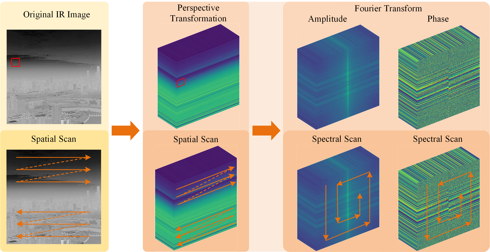

# FIRE-Net
Frequency-Spatial Interaction Reinforcement Paradigm for Infrared Small Target Detection

Yongji Li, Luping Wang, and Shichao Chen

# Abstract
Infrared (IR) search and track systems are widely applied in aerospace and defense fields. Infrared small target detection (IRSTD) in heavy clouds and chaotic terrestrial environments remains a challenging task. The semantic features of IR small targets are highly prone to vanishing with the addition of network layers. Transformer with quadratic computational complexity struggles for local feature refinement. To tackle this issue, we introduce a Mamba-driven approach dubbed Frequency-Spatial Interaction Reinforcement Network (FIRE-Net). Specifically, the perspective transformation structures heterogeneous backgrounds. The reconstructed data couples Mamba's flattened multidirectional scanning mechanism. Given that small targets possess sparse and high-frequency properties, spatial Mamba and frequency Mamba collaboratively enrich the semantic features of small targets. The Texture Enhancement Module (TEM) effectively fuses spatial and frequency features to enhance the contrast information of small targets. To refine the features, the Fine-Grained Reinforcement Module (FRM) integrates multiple gradient operators to inscribe the intact small target profile. Both qualitative and quantitative experiments demonstrate that our proposed FIRE-Net outperforms 14 recent benchmark algorithms on multiple public datasets.

# Models
Quantitative comparison of model complexity with open source models:

|Methods   | FLOPs(G) | Params(M)   |
|--------|-----|--------|
| AGPCNet   | 172.86  | 12.36   |
| UIU-Net   | 218.35  | 50.54   |
| MMRFF-Net   | 0.58  | 0.44   |
| DNA-Net   | 56.68  | 4.70   |
| ISTDU-Net   | 34.27  | 2.76   |
| GCLNet   | 22.53  | 19.04   |
| FIRE-Net   | 81.69  | 8.87   |

 
